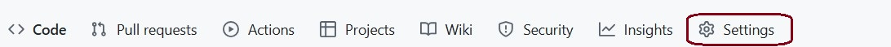
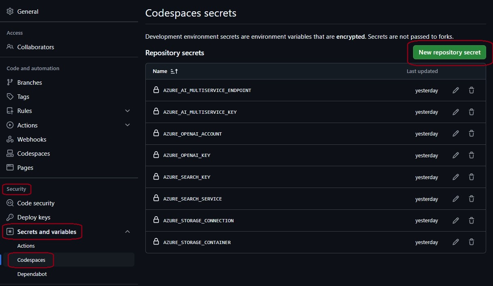
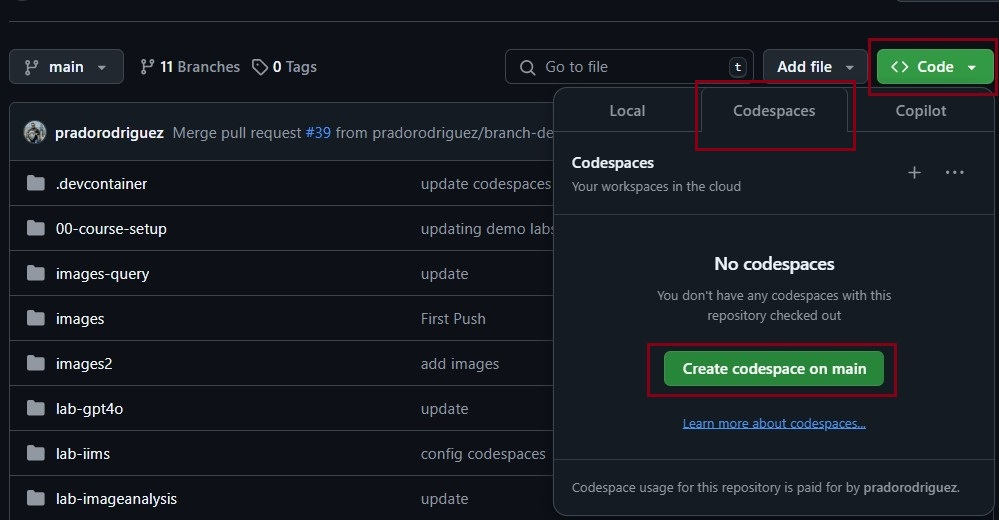
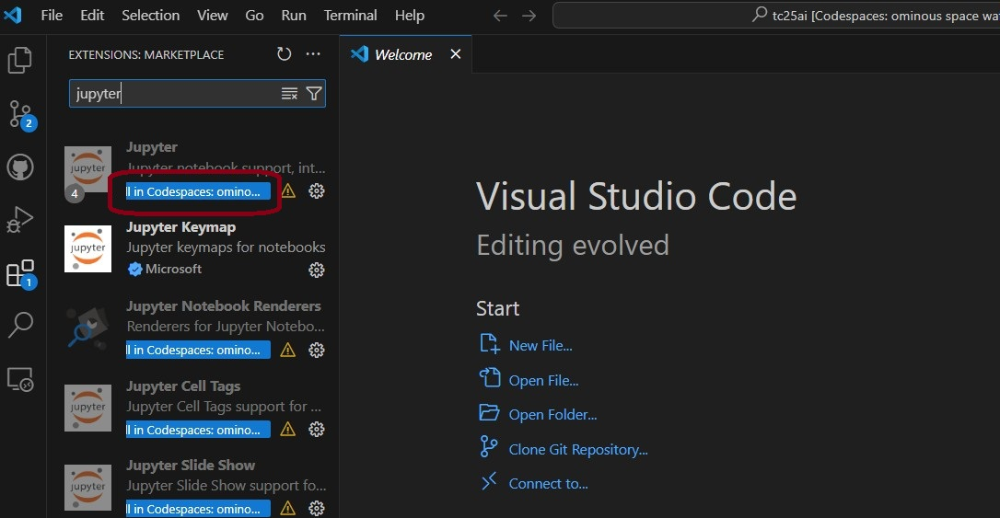
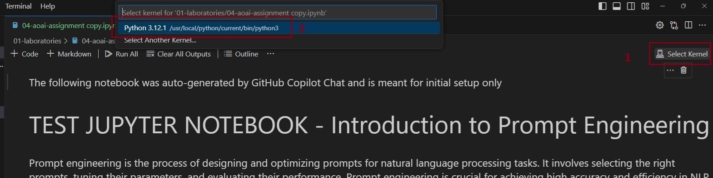
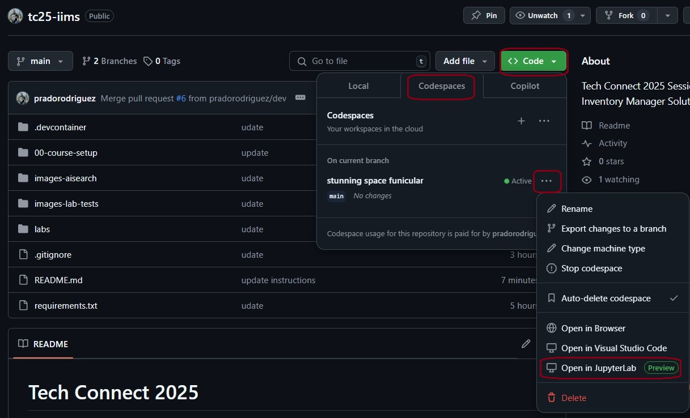

# Setup Your CodeSpace Environment

## Create CodeSpaces Secrets

To properly execute the code and demos of this workshop, several Azure Keys and Values must be created as environment variables (CodeSpaces Secrets).

> [!IMPORTANT]
> **The Keys and Values will be provided by the speaker at the beginning of the session.**

* In your fork of the main repo, go to the **Settings** button in the top menu bar.

* In the left navigation panel, go to: **Security** -> **Secrets and Variables** -> **Codespaces**.
* Create each secret below by clicking the **New repository secret**.  Take care to name them exactly as shown, as these will be the names of the variables inside of the codespaces environment.

* These are the keys for the secrets: (do not use quotes or blank spaces):

| Key/Secret  | Value  |
| :--- | :--- |
| AZURE_SEARCH_SERVICE | https://FAKE-ACCOUNT.search.windows.net |
| AZURE_SEARCH_KEY | <key_value_provided_by_speaker> |
| AZURE_OPENAI_ACCOUNT | https://FAKE-ACCOUNT.openai.azure.com/ |
| AZURE_OPENAI_KEY | <key_value_provided_by_speaker> |
| AZURE_AI_MULTISERVICE_ENDPOINT | https://FAKE-ACCOUNT.cognitiveservices.azure.com/ |
| AZURE_AI_MULTISERVICE_KEY | <key_value_provided_by_speaker> |
| AZURE_STORAGE_CONNECTION | ResourceId=/subscriptions/FAKE-SUBCRIPTION=ID/resourceGroups/FAKE-RESOURCE-GROUP/providers/Microsoft.Storage/storageAccounts/FAKE-ACCOUNT; |
| AZURE_STORAGE_CONTAINER | <key_value_provided_by_speaker> |
| | |

## Create the CodeSpaces environment

On the main page of your forked version of this repo, go to: **Code** -> **Codespaces** tab -> **Create codespace on main**.

> [!NOTE]
> This step will automatically open a new browser explorer tab with an online version of Visual Studio Code. This will be your CodeSpaces environment.

### Configure the CodeSpaces VSCode environment

* **Enable the Jupyter extension**: click the **Extensions** buttom located in the left Visual Studio navigation bar, in the upper search box, type **Jupyter** and click the **Install** buttom.

### How to run the labs/code?

* The demos are provided as Jupyter notebooks (`.ipynb` files).
* **To run the Jupyter Notebook**, inside Github Codespaces Visual Studio Code, select the demo inside the **labs** folder, then click **Select Kernel** (at top right of the jupyter notebook) and select the default **Python 3.12.1** option shown.
* You can now **Run** each action (piece of code) or **Run All** to execute the whole notebook.

## ALTERNATIVE OPTION TO CODESPACES VISUAL STUDIO CODE: JupyterLab

* An alternative to using CodeSpaces Visual Studio Code is CodeSpaces JupyterLab.
* With the CodeSpaces environment created.
* Close the newly opened browser tab with Online Visual Studio Code.
* On the main page of your forked version of this repo, go to: **Code** -> **Codespaces** tab -> click the **elipsis (...)** buttom (next to the CodeSpaces environment name) -> click **Open in JupyterLab**.

## Let's Get Started

The code and demos are located in the **[./labs folder](../labs/)**
